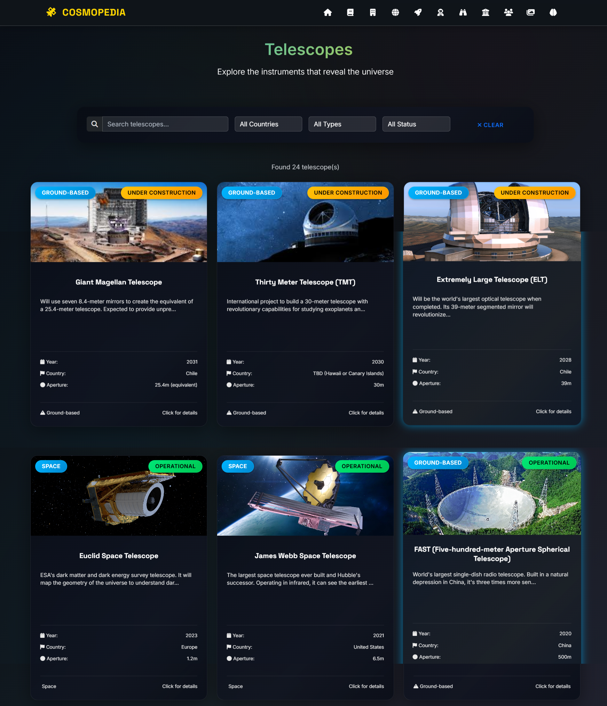
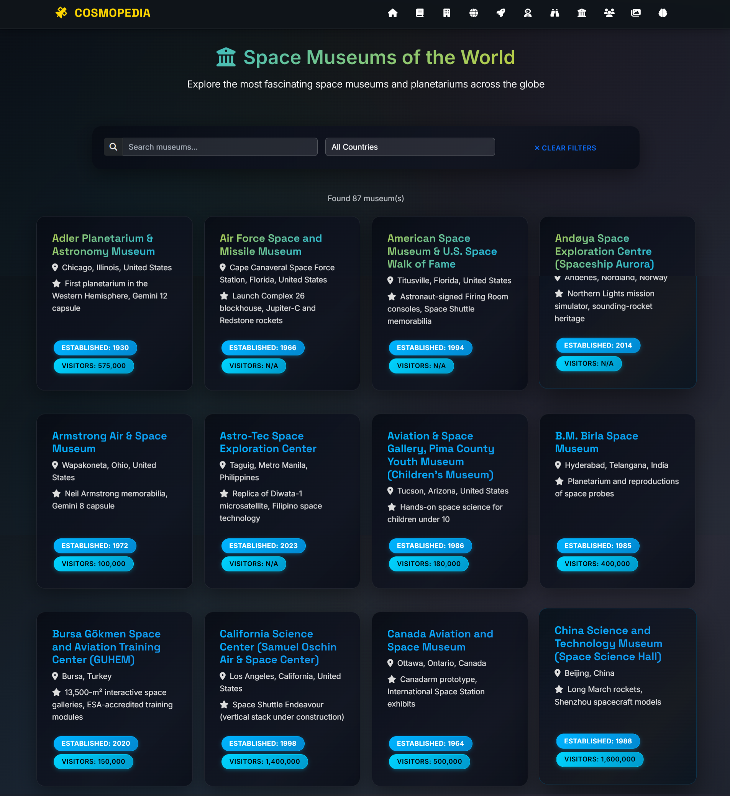
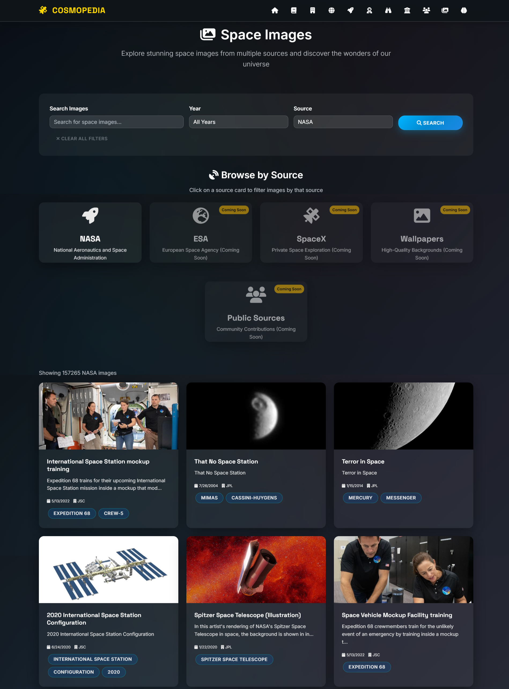

# 🌌 CosmoPedia - Unified Space Knowledge Platform

## 💡 Inspiration

As space aspirants, my team and I were constantly frustrated by the scattered nature of space-related information across the internet. Whether we were researching rockets, learning about astronauts, or exploring space terminology, we had to visit multiple websites and sources. We realized there was no single, comprehensive platform where space enthusiasts could access all this valuable information in one place. This gap inspired us to create CosmoPedia - a unified knowledge base that brings together verified space data from multiple open sources.

## 🚀 What it does

CosmoPedia is a unified, open-access space knowledge platform that consolidates space information from multiple verified open sources into a single accessible interface. Built for students, professionals, and space enthusiasts, it provides a unified experience for exploring the vast universe of space knowledge.

     

## 🏗️ Project Architecture

### 📁 Main Application Structure

```
CosmoPedia/
├── app.py                          # Main Flask application (871 lines)
├── vector_search.py                # FAISS vector search implementation (320 lines)
├── knowledge_base_docs.pkl         # Serialized knowledge base documents (336KB)
├── knowledge_base_index.faiss      # FAISS vector index (944KB)
├── requirements.txt                # Python dependencies
├── Procfile                        # Deployment configuration
├── .python-version                 # Python version specification
├── data/                           # JSON data files
│   ├── space_terminology.json      # Space terms and definitions (336KB, 4958 lines)
│   ├── astronauts.json             # Astronaut profiles (39KB, 963 lines)
│   ├── notable_peoples.json        # Notable people data (55KB, 1479 lines)
│   ├── space_museams.json          # Space museums (32KB, 788 lines)
│   ├── telescopes.json             # Telescope information (18KB, 461 lines)
│   ├── space_agencies.json         # Space agencies (12KB, 317 lines)
│   ├── rockets.json                # Rocket systems (30KB, 395 lines)
│   └── planets.json                # Solar system planets (11KB, 266 lines)
├── templates/                      # HTML templates
│   ├── base.html                   # Base template (52KB, 1001 lines)
│   ├── index.html                  # Homepage (30KB, 633 lines)
│   ├── chat.html                   # AI chat interface (15KB, 508 lines)
│   ├── terminologies.html          # Space terms page (39KB, 1107 lines)
│   ├── agencies.html               # Space agencies page (22KB, 548 lines)
│   ├── planets.html                # Planets page (20KB, 511 lines)
│   ├── rockets.html                # Rockets page (21KB, 529 lines)
│   ├── astronauts.html             # Astronauts page (21KB, 516 lines)
│   ├── telescopes.html             # Telescopes page (18KB, 383 lines)
│   ├── museums.html                # Museums page (12KB, 285 lines)
│   ├── notable_people.html         # Notable people page (25KB, 664 lines)
│   ├── images.html                 # NASA images gallery (45KB, 1405 lines)
│   ├── missions.html               # Missions page (19KB, 409 lines)
│   └── [additional template files]
└── static/                         # Static assets
    ├── css/
    │   ├── space-theme.css         # Main space theme styles (29KB, 1252 lines)
    │   ├── preloader.css           # Loading animations (4.3KB)
    │   └── quantum-preloader.css   # Quantum-themed loader (3.7KB)
    └── js/
        ├── space-theme.js          # Main JavaScript functionality (18KB, 610 lines)
        ├── preloader.js            # Loading animations (59KB, 1663 lines)
        ├── space-preloader.js      # Space-themed loader (15KB, 450 lines)
        ├── preloader-clean.js      # Clean loader version (19KB, 583 lines)
        └── performance.js          # Performance optimizations (8.9KB, 248 lines)
```

### 🔧 API Middleware Structure

```
Swagger_Api/
├── app.py                          # Swagger API application (740 lines)
├── requirements.txt                # API dependencies
├── Procfile                        # API deployment config
├── README.md                       # API documentation
├── data/                           # API data files
│   ├── astronauts.json
│   ├── notable_peoples.json
│   ├── planets.json
│   ├── rockets.json
│   ├── space_agencies.json
│   ├── space_museams.json
│   ├── space_terminology.json
│   └── telescopes.json
├── templates/
│   └── index.html                  # API documentation interface
└── static/
    ├── css/
    │   └── style.css               # API documentation styles
    └── js/
        └── script.js               # API documentation scripts
```

## 🖼️ Screenshots

### Main Interface

*Homepage with navigation and feature overview*


*Built-in documentation modal with comprehensive platform guide*

### Knowledge Categories


*Space terminologies database*


*Global space agencies information*


*Solar system planets data*


*Rocket systems and launch vehicle database*


*Astronaut profiles and achievements*


*Ground and space-based telescope information*


*Global space museums directory*


*Scientists and space pioneers profiles*


*NASA image gallery integration*

### AI & API Features


*AI-powered chat with vector search capabilities*


*RESTful API endpoints for all data categories*


*API documentation and testing interface*

## ✨ Platform Features

- **Space Terminologies** - Database of space-related terms and definitions
- **Space Agencies** - Information about space organizations worldwide
- **Planets** - Solar system planets with scientific data
- **Rockets** - Database of launch vehicles and rocket systems
- **Astronauts** - Profiles of space explorers
- **Telescopes** - Ground and space-based observatories
- **Notable People** - Scientists, astrophysicists, and space pioneers
- **Space Museums** - Global directory of space museums
- **Space Images** - NASA image gallery integration
- **AI Chat** - Mistral LLM-powered assistant that retrieves and enhances responses from our pre-built verified knowledge base using FAISS vector search
- **Open Source APIs** - RESTful endpoints for all data categories

## 🛠️ How we built it

We built CosmoPedia using modern web technologies with a focus on open access and API-first design:

- **Backend** - Flask (Python) for server-side processing
- **Frontend** - HTML5, CSS3, and JavaScript with space-themed responsive design
- **Data Sources** - Aggregated from multiple verified open sources
- **AI Integration** - Mistral LLM with FAISS vector search for retrieving and enhancing responses from verified knowledge base
- **API Design** - RESTful endpoints for all data categories
- **Storage** - JSON-based data storage with FAISS vector indexing for semantic search of pre-built knowledge base

## 🚧 Challenges we ran into

- **Data Aggregation** - Collecting and standardizing data from multiple open sources while maintaining accuracy
- **FAISS Integration** - Implementing vector search capabilities for semantic queries within our knowledge base
- **Mistral LLM Integration** - Setting up AI chat to enhance responses from verified knowledge base documents
- **Data Consistency** - Ensuring consistent formatting across different data categories
- **API Design** - Creating intuitive RESTful endpoints for all data types

## 🏆 Accomplishments that we're proud of

- **Unified Knowledge Base** - Successfully aggregated space data from 10 different categories into one platform
- **Open Source APIs** - Created RESTful APIs that other developers can use for free
- **AI Integration** - Implemented Mistral LLM with FAISS vector search to retrieve and enhance responses from our verified knowledge base
- **User Experience** - Designed an intuitive space-themed interface for easy exploration
- **Data Accessibility** - Made space knowledge freely accessible to students, professionals, and enthusiasts
- **Community Impact** - Built a resource for learning, research, and building space applications

## 📚 What we learned

- **Data Integration** - Gained experience in aggregating and normalizing data from multiple open sources
- **Vector Search** - Learned to implement FAISS for semantic search within our curated knowledge base
- **AI Integration** - Understood how to integrate Mistral LLM to enhance responses from verified knowledge base documents
- **API Design** - Developed skills in creating user-friendly RESTful APIs
- **Space Domain Knowledge** - Expanded our understanding of space exploration and terminology
- **Open Source Development** - Learned the importance of making knowledge freely accessible

## 🚀 What's next for CosmoPedia

- **Comets & Asteroids explorer**
- **Satellites & space probes**
- **Solar system & exoplanet data**
- **Real & upcoming astronomical events**
- **Space launches & mission timelines**
- **Community Q&A & expert contributions**
- **Continuous data updates & new resource types**

## 📖 Platform Documentation

CosmoPedia includes comprehensive built-in documentation accessible through the documentation modal on the homepage, featuring:

### What is CosmoPedia?
CosmoPedia is a unified, open-access space knowledge platform for everyone—students, professionals, and enthusiasts. Our mission is to empower you with the knowledge and tools to explore, learn, and stay updated on the universe and space exploration.

### How CosmoPedia Helps You
- Learn space concepts, discoveries, and missions
- Implement best practices and digital exploration
- Stay updated with tools, roles, and protocols
- Access open data for your own projects
- Raise awareness and build a more informed society

### Navigation Guide
The platform provides easy navigation through color-coded badges for all categories:
- Terminologies, Agencies, Planets, Rockets, Astronauts
- Telescopes, Museums, Notable People, Images, AI Chat
- Comets, Satellites, Solar System, Events (coming soon)

## 🛠️ Built With

- **bootstrap**
- **css3**
- **faiss**
- **flask**
- **html5**
- **javascript**
- **json**
- **mistral-llm**
- **python**
- **restapi**

## 🌐 Live Platforms

### Main Application
**Live Platform:** [cosmo-pedia-e6blv.ondigitalocean.app](https://cosmo-pedia-e6blv.ondigitalocean.app)

**Hugging Face Space:** [huggingface.co/spaces/aradhyapavan/casmopedia](https://huggingface.co/spaces/aradhyapavan/casmopedia)

**GitHub Repository:** [github.com/aradhyapavan-projects/cosmopedia](https://github.com/aradhyapavan-projects/cosmopedia)

### API Documentation
**API Documentation:** [cosmopedia-api-v1-d045176bccfa.herokuapp.com](https://cosmopedia-api-v1-d045176bccfa.herokuapp.com)

## 🔧 API Development & Usage

### Swagger API Documentation
Our comprehensive API is documented using Swagger/OpenAPI specifications, providing interactive documentation where developers can:
- Explore all available endpoints
- Test API calls directly from the browser
- View request/response schemas
- Understand authentication requirements
- Access code examples in multiple languages

### API Architecture
The CosmoPedia API follows RESTful principles with:
- **Base URL:** `http://127.0.0.1:5000/` (Local Development)
- **Production URL:** `https://cosmopedia-api-v1-d045176bccfa.herokuapp.com`
- **Format:** JSON responses
- **Authentication:** Open access (no API key required)
- **Rate Limiting:** Fair usage policy applied
- **CORS:** Enabled for cross-origin requests

### Available Endpoints
- `GET /api/terms` - Space terminology database
- `GET /api/agencies` - Space agencies worldwide
- `GET /api/planets` - Solar system planets data
- `GET /api/rockets` - Launch vehicles and rocket systems
- `GET /api/astronauts` - Space explorer profiles
- `GET /api/telescopes` - Observatory information
- `GET /api/notable-people` - Scientists and pioneers
- `GET /api/museums` - Space museums directory
- `POST /api/search` - Vector search across all data
- `POST /api/chat` - AI chat functionality

### How to Use the API

#### Basic Usage Example
```javascript
// Fetch all space agencies
fetch('http://127.0.0.1:5000/api/agencies')
  .then(response => response.json())
  .then(data => console.log(data));

// Search for Mars-related content
fetch('http://127.0.0.1:5000/api/search', {
  method: 'POST',
  headers: {
    'Content-Type': 'application/json',
  },
  body: JSON.stringify({
    query: 'Mars exploration missions'
  })
})
.then(response => response.json())
.then(results => console.log(results));
```

#### Python Example
```python
import requests

# Get all rockets data
response = requests.get('http://127.0.0.1:5000/api/rockets')
rockets = response.json()

# Perform semantic search
search_payload = {
    "query": "International Space Station"
}
search_response = requests.post(
    'http://127.0.0.1:5000/api/search',
    json=search_payload
)
search_results = search_response.json()
```

## 🚀 Getting Started

### Prerequisites
- Python 3.11+
- pip package manager
- Git for version control

### Installation Steps

#### 1. Clone the Repository
```bash
# Clone the main repository
git clone https://github.com/aradhyapavan-projects/cosmopedia.git
cd cosmopedia
```

#### 2. Set Up Main Application
```bash
# Navigate to main application
cd CosmoPedia

# Install dependencies
pip install -r requirements.txt

# Run the application
python app.py

# Access at http://127.0.0.1:5000/
```

#### 3. Set Up API Middleware (Optional)
```bash
# Navigate to API directory
cd ../Swagger_Api

# Install API dependencies
pip install -r requirements.txt

# Run the API server
python app.py

# Access API at http://127.0.0.1:5000/
# Swagger UI at http://127.0.0.1:5000/docs
```

### Development Environment
- **Main App**: Flask development server
- **API Server**: Separate Flask instance for API endpoints
- **Vector Search**: Pre-built FAISS index for fast semantic search
- **AI Integration**: Mistral LLM with rate limiting

### Configuration
- **Environment Variables**: Set API keys for external services
- **Data Files**: JSON data files in `data/` directory
- **Static Assets**: CSS/JS files in `static/` directory
- **Templates**: HTML templates in `templates/` directory

## 🤝 Contributing

### Development Workflow
1. **Fork the Repository** - Fork [https://github.com/aradhyapavan-projects/cosmopedia](https://github.com/aradhyapavan-projects/cosmopedia) to your GitHub account
2. **Clone Your Fork** - Download your forked repository locally
   ```bash
   git clone https://github.com/[your-username]/cosmopedia.git
   ```
3. **Navigate to Main App** - Go to the `CosmoPedia/` directory within the cloned repository
4. **Local Development** - Set up the Flask application locally at `http://127.0.0.1:5000/`
5. **Create Branch** - Create a new branch for your features
   ```bash
   git checkout -b feature/your-feature-name
   ```
6. **Extend Functionality** - Add new features or data categories
7. **Commit Changes** - Commit your improvements
   ```bash
   git add .
   git commit -m "Add your feature description"
   git push origin feature/your-feature-name
   ```
8. **Pull Request** - Submit a pull request to the main repository
9. **Deploy Your Version** - Host your enhanced application instance

### Areas for Contribution
- **New Data Categories** - Add more space knowledge domains
- **UI/UX Improvements** - Enhance user interface and experience
- **API Enhancements** - Add new endpoints and features
- **Documentation** - Improve code and user documentation
- **Testing** - Add comprehensive test coverage
- **Performance** - Optimize search and response times

### Code Standards
- **Python**: PEP 8 style guide
- **JavaScript**: ESLint configuration
- **HTML/CSS**: Semantic markup and responsive design
- **Documentation**: Clear docstrings and comments

## 📄 License

This project is licensed under the MIT License - see the [LICENSE](LICENSE) file for details.

## 🙏 Acknowledgments

- **NASA** - For space images and mission data
- **Space Agencies Worldwide** - For comprehensive space information
- **Open Source Community** - For the tools and libraries used
- **Space Enthusiasts** - For inspiration and feedback

---

*Built with ❤️ for space enthusiasts everywhere*

*Last Updated: December 2024*
